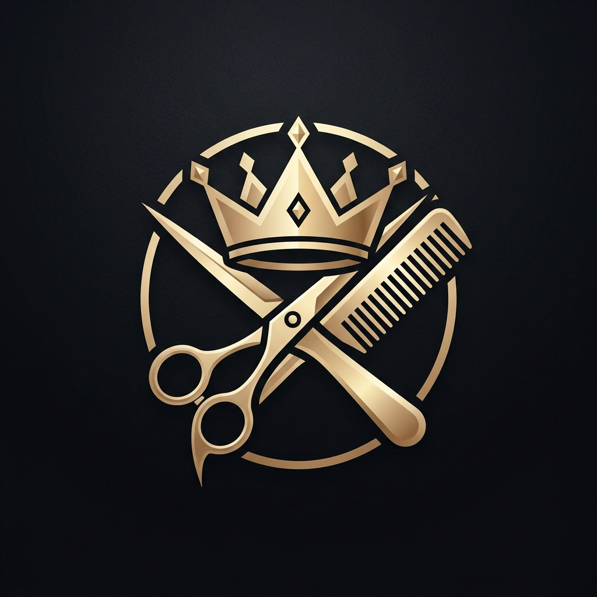

# ✂️ Elite Salon - Luxury Salon & Grooming App

<p align="center">
  
</p>

<p align="center">
  <b>A luxury, modern Flutter application for salon booking, stylist consultations, service discovery, and AI-powered hairstyle previews.</b>
</p>

<p align="center">
  <a href="https://katariyamihir67.github.io/hairsaloon/"></a>
  <a href="https://github.com/katariyamihir67/hairsaloon/releases"></a>
  
  
</p>

---

## 🌟 Highlights & Features

- **💎 Luxury Dark/Gold UI Design**: Designed with a sleek gold-and-charcoal luxury theme tailored for premium grooming salons.
- **💈 Comprehensive Service Catalog**:
  - Men's Signature Haircuts, Beard Styling, Fade & Classic Cuts.
  - Women's Balayage, Keratin Spa, Layer Cuts & Bob Cuts.
  - Luxury Spa, Skin Care & Head Massages.
- **👨‍🎨 Top Stylist Profiles**: Browse stylist portfolios, ratings, specializations, and book directly with your favorite barber/stylist.
- **🤖 AI Hair Style Preview**: Interactive AI style preview letting clients visualize modern haircuts before getting styled.
- **📅 Easy Booking & Appointment Management**: Real-time slot selection, date picker, booking confirmation, and status tracking.
- **📱 Cross-Platform**: Runs seamlessly on Android, Web, Windows, macOS, and Linux.

---

## 🚀 Live Demo & Mobile App

- 🌐 **Web App (Live Demo)**: [https://katariyamihir67.github.io/hairsaloon/](https://katariyamihir67.github.io/hairsaloon/)
- 📱 **Android APK**: [Download latest APK](https://github.com/katariyamihir67/hairsaloon/releases)

---

## 🛠️ Tech Stack & Architecture

- **Framework**: [Flutter](https://flutter.dev/) (Channel stable)
- **Language**: [Dart](https://dart.dev/)
- **State Management**: [Riverpod](https://riverpod.dev/) (`flutter_riverpod`)
- **Navigation**: [GoRouter](https://pub.dev/packages/go_router)
- **Design & Typography**: [Google Fonts (Cinzel, Montserrat, Outfit)](https://fonts.google.com/) & [Lucide Icons](https://lucide.dev/)
- **Image Caching & Shimmer**: `cached_network_image`, `shimmer`

---

## 📂 Project Structure

```
lib/
├── core/
│   ├── constants/       # App constants and colors
│   ├── providers/       # Riverpod state providers
│   ├── router/          # GoRouter configuration
│   └── theme/           # Dark/Light gold luxury theme
├── data/
│   ├── models/          # Data transfer models
│   └── repositories/    # Mock repositories & data sources
├── domain/
│   └── entities/        # Core business entities (Service, Stylist, Booking)
├── presentation/
│   ├── auth/            # Splash and Auth screens
│   ├── booking/         # Appointment booking flow
│   ├── home/            # Home dashboard & luxury navigation drawer
│   ├── services/        # Service details and categories
│   ├── stylists/        # Stylist profiles and reviews
│   └── ai_preview/      # AI Hairstyle preview feature
└── shared/
    └── widgets/         # Reusable luxury cards, buttons, dialogs
```

---

## ⚙️ Getting Started Locally

### Prerequisites
- Flutter SDK `>=3.2.0`
- Android Studio or VS Code with Flutter extension

### Installation & Run

1. Clone the repository:
   ```bash
   git clone https://github.com/katariyamihir67/hairsaloon.git
   cd hairsaloon
   ```

2. Install dependencies:
   ```bash
   flutter pub get
   ```

3. Run on Chrome (Web):
   ```bash
   flutter run -d chrome
   ```

4. Run on Android Device / Emulator:
   ```bash
   flutter run
   ```

---

## 📄 License
This project is open-source and available for demonstration and personal portfolio use.
